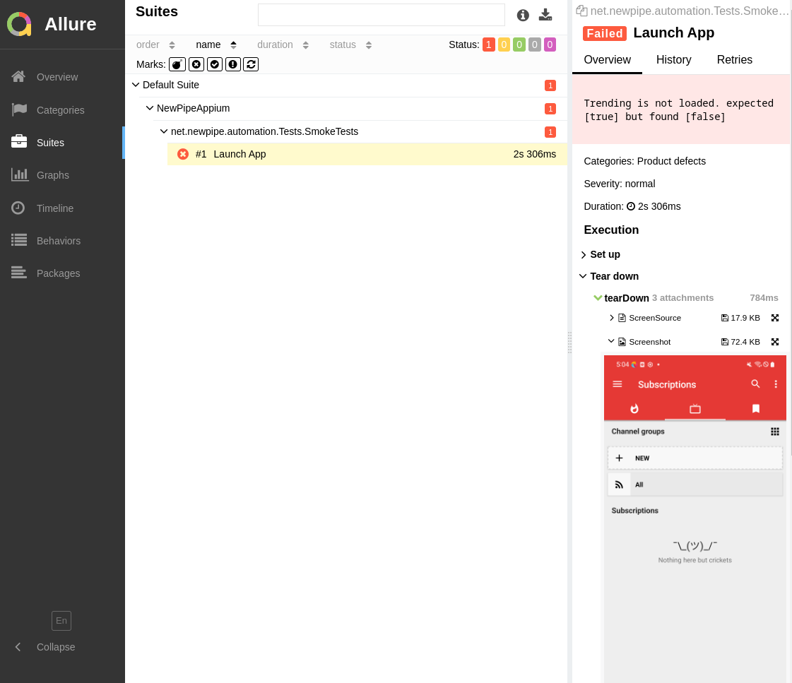
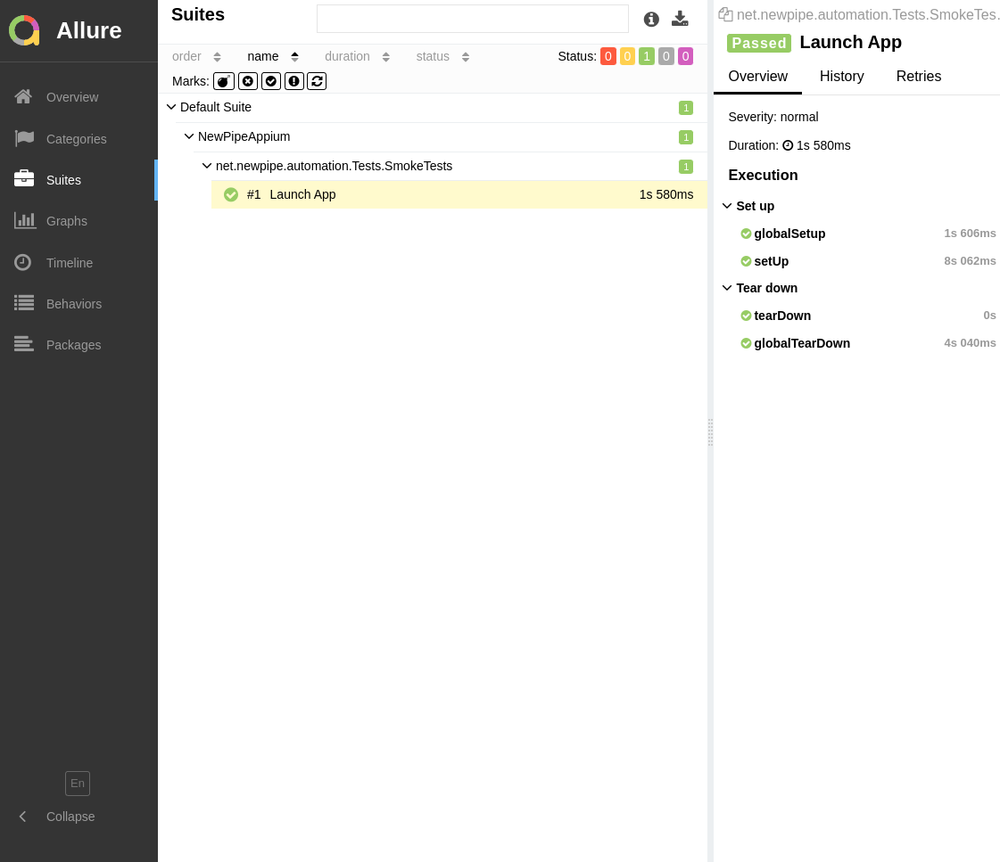

# Mobile Automation for the NewPipe app
**Java + TestNG + Maven + Appium**

- Page Object Model
- Screenshot on failure
- Screen Recording
- Allure Reports

## Requirements
- JDK11
- Appium 1.22.x

## Appium Installation
`npm install -g appium@1.22`

## How to run

`cd {repo folder}`

`mvn clean test`

## How to generate report

Install Allure

`sudo npm i -g allure-commandline`

Generate report

`cd {repo folder}`

`allure serve -h localhost allure-results`

## Report screenshots

